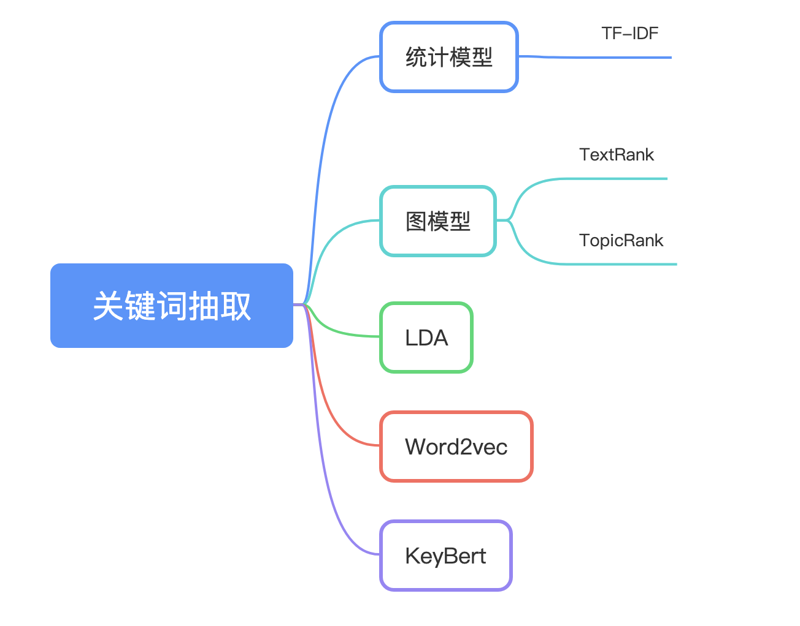

#  中英文关键词抽取
欢迎使用关键词抽取，支持多种关键词抽取算法，涵盖内容如下图所示：



## 介绍

关键词抽取支持多种算法，算法如下：
- [中英文关键词抽取](#中英文关键词抽取)
  - [介绍](#介绍)
  - [API](#api)
    - [1.TF-IDF](#1tf-idf)
    - [2.TextRank](#2textrank)
    - [3.KeyBERT](#3KeyBERT)
  - [路线](#路线)
  - [注意](#注意)


---
## API


### 1.TF-IDF


```python
from keyword_extract import KeywordExtract


input_list = [
    "自然语言处理是人工智能领域中的一个重要方向。它研究人与计算机之间如何使用自然语言进行有效沟通。"
]
key_extract = KeywordExtract(type="TF-IDF")
# 基于TF-IDF进行关键词的抽取
print(key_extract.infer(input_list))
```

### 2.TextRank


```python
from keyword_extract import KeywordExtract

    
input_list = ["自然语言处理是人工智能领域中的一个重要方向。它研究人与计算机之间如何使用自然语言进行有效沟通。"]
key_extract = KeywordExtract(type="TextRank")
# 基于TextRank进行关键词的抽取
print(key_extract.infer(input_list))

```
### 3.KeyBERT


```python
from keyword_extract import KeywordExtract

    
input_list = ["自然语言处理是人工智能领域中的一个重要方向。它研究人与计算机之间如何使用自然语言进行有效沟通。"]
key_extract = KeywordExtract(type="KeyBERT")
# 基于KeyBERT进行关键词的抽取
print(key_extract.infer(input_list))

```

## 路线

* [X] 支持TF-IDF关键词抽取算法
* [X] 支持TextRank关键词抽取算法
* [X] 支持KeyBERT关键词抽取算法
* [ ] 其他


## 注意
可以去https://hf-mirror.com/google-bert/bert-base-chinese 下载对应的权重， 然后放在keyword_extract/data/pre_model/bert_base_chinese中，就可以使用KeyBERT关键词抽取方法。


