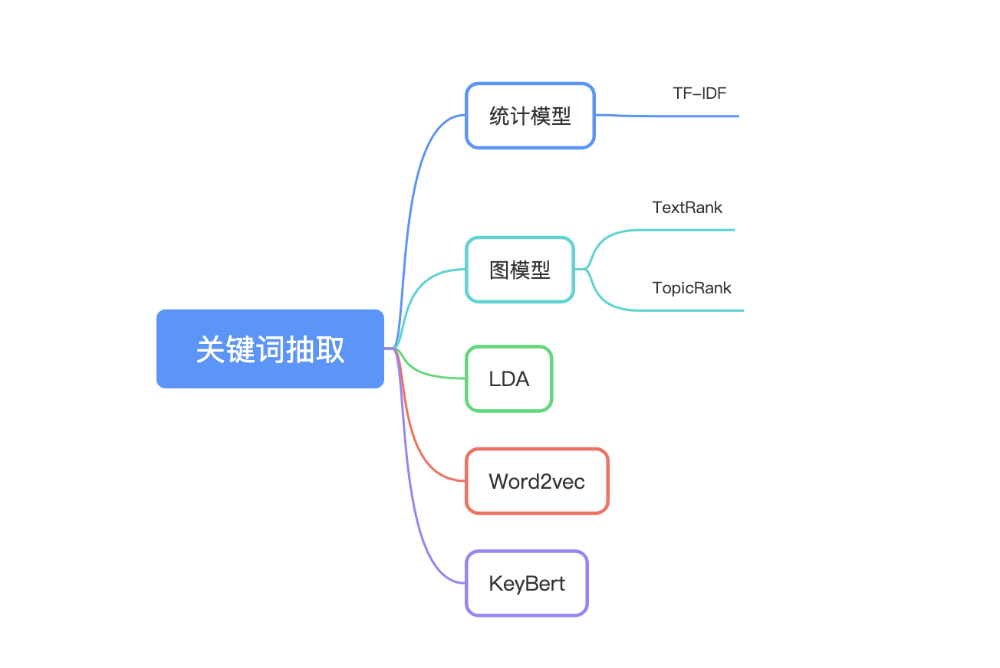

#  中英文关键词抽取
欢迎使用关键词抽取，支持多种关键词抽取算法，涵盖内容如下图所示：



## 介绍

关键词抽取支持多种算法，算法如下：
- [1.TF-IDF](#1TF-IDF)
- [2.TextRank](#2TextRank)
- [3.其他](#3其他)


---
## API


### 1.TF-IDF


```python
from app.key_extract import KeywordExtract

    
input_list = ["自然语言处理是人工智能领域中的一个重要方向。它研究人与计算机之间如何使用自然语言进行有效沟通。"]
key_extract = KeywordExtract()
# 基于TF-IDF进行关键词的抽取
print(key_extract.infer(input_list))

```

### 2.TextRank


```python
from app.key_extract import KeywordExtract

    
input_list = ["自然语言处理是人工智能领域中的一个重要方向。它研究人与计算机之间如何使用自然语言进行有效沟通。"]
key_extract = KeywordExtract()
# 基于TF-IDF进行关键词的抽取
print(key_extract.infer(input_list, type="TextRank"))

```


## 路线

* [X] 支持TF-IDF关键词抽取算法
* [X] 支持TextRank关键词抽取算法
* [] 其他

